# SilkLens — Core Heritage Domain Architecture

**Agent 1 of 8 — Core Domain Architect**
**Date:** 2026-05-18
**Status:** v1.0 (initial design)
**Stack:** PostgreSQL 16 + pgvector + PostGIS, Alembic, Clean Architecture, FastAPI

---

## 0. Reading Conventions

- All table names are plural snake_case (`heritage_objects`, `geographic_places`).
- All primary keys are `uuid` v7 (time-ordered, sortable, generated via `uuid_generate_v7()` from a custom Postgres function or `pg_idkit`). Rationale: globally unique across multi-region replicas, sortable for cache locality, never leaks user counts.
- `timestamptz` everywhere; the database `TIMEZONE` is `UTC`; application converts on read.
- `citext` for case-insensitive identifiers (slugs, codes, language tags).
- Every domain table has `created_at`, `updated_at`, `deleted_at`, `created_by`, `updated_by`, `version` (monotonic integer for optimistic concurrency), `revision_id` (FK to revision log).
- Soft-delete by default; hard-delete only via the GDPR purge pipeline (Agent 4's responsibility).
- All translatable text fields follow the **Hybrid Localization Strategy** defined in §5.

---

## 1. Domain Analysis

The cultural-heritage domain is deceptively rich. A naive `monuments(id, name, lat, lng)` schema collapses under contact with reality within weeks. SilkLens must model a domain that has been debated by UNESCO, ICOMOS, ICOM, Getty, and the Wikidata heritage community for decades, and we are doing it at global scale, in 200 languages, with admin-editable taxonomy and per-fact provenance.

**Five irreducible characteristics of heritage data that drive every architectural choice:**

**1. Heritage is polymorphic, not monolithic.** A "heritage object" can be a single building (Bibikhanym Mosque), an archaeological park containing hundreds of features (Afrosiyob), a city center (Old Bukhara), a route (the Silk Road itself), an intangible practice (Shashmaqom music), a movable artifact (a Sogdian fresco in the Hermitage), or a natural-cultural mixed site (Tianshan). These cannot share one rigid schema. We solve this with a `heritage_objects` table that carries a polymorphic `kind` discriminator backed by `heritage_kinds` (admin-editable controlled vocabulary), plus type-specific extension tables joined 1:0..1 (`heritage_archaeological_ext`, `heritage_intangible_ext`, `heritage_natural_ext`). Common fields stay in the base table; specialized fields live in extensions. New types added by admin without migration.

**2. Every fact has a source, a confidence, and may be wrong.** Per Project-Decisions §9 and §11, content comes from Wikipedia, Wikidata, AI generation, UGC, B2B partners, and expert review — each with wildly different trust. We do not store "the truth" — we store **claims** with provenance. The `heritage_facts` table is structured as quintuples `(heritage_id, predicate, value, source, confidence)` rather than wide columns. Hot/canonical claims are materialized to `heritage_objects` for fast reads, but the underlying claim history is preserved forever for audit, dispute resolution, and ML training.

**3. Heritage is fundamentally hierarchical AND networked.** It is hierarchical by geography (continent → country → region → city → site → sub-feature), by time (era → period → dynasty → reign), by taxonomy (religious → Islamic → Timurid → madrasah). It is networked by relations: Bibikhanym was *commissioned by* Timur, *inspired by* the Friday Mosque of Delhi, *located near* the Siyob Bazaar, *part of* the Samarkand UNESCO site, *restored by* Soviet conservators in 1974, and *replaced* an older Friday mosque. We model the hierarchy with `ltree` (PostgreSQL native, query-friendly) and the network with `heritage_relations` (typed edges).

**4. Multilingual is not "add a translation column" — it is a first-class concern.** Right-to-left scripts (Arabic, Persian, Hebrew), historical names (Maracanda → Marakanda → Samarqand → Samarkand), transliterations (Cyrillic/Latin Uzbek), endonyms vs exonyms (München vs Munich), and dialects (Tajik Persian vs Iranian Persian) demand a strategy beyond `name_en`/`name_ru` columns. We use a hybrid: a normalized `localized_strings` side-table for full-content translations (review queue, MT confidence, translation memory), and `jsonb` snapshots on hot read paths (`name_i18n jsonb`) for query simplicity. Aliases and historical names get their own `heritage_aliases` table because they are queryable, datable, and source-tagged.

**5. Heritage data evolves but never forgets.** A monument's "construction year" may be revised when carbon dating arrives. UNESCO inscription is appended. Wars destroy and restore. Admins make mistakes that must be rolled back. We use the **bi-temporal pattern**: each canonical row carries a `version` and `valid_from`/`valid_to`; a parallel `heritage_revisions` table stores complete row snapshots (full JSON) on every mutation, plus diff and actor. Rollback is `UPDATE heritage_objects SET ... FROM heritage_revisions WHERE revision_id = ?`.

**Philosophical edge cases we accept:**
- Two objects, same name, same coordinates, different periods (Old vs New Bukhara Friday Mosque on same lot). We do **not** dedupe by coordinates.
- An object can have *zero* confirmed coordinates (intangible heritage, lost monuments). Geometry is nullable.
- An object can be a *member of itself* transitively (Samarkand is part of Uzbekistan, which is on Earth). We enforce DAG via trigger on `heritage_relations`.
- An object can have *contested* metadata (Iran/Azerbaijan over Nizami's birthplace). We store multiple claims with `source` and `disputed: true`.

---

## 2. Entity Discovery Report

The roadmap mentions "monuments, languages, content". Below is the full entity decomposition this domain actually requires. Tables marked **[ROADMAP-MISSED]** were not anticipated but are non-negotiable for production.

| # | Entity | Purpose |
|---|---|---|
| 1 | `heritage_objects` | Canonical heritage record (polymorphic root). |
| 2 | `heritage_kinds` | Admin-editable controlled vocabulary of heritage types (monument, site, intangible…). **[ROADMAP-MISSED]** |
| 3 | `heritage_archaeological_ext` | Type-specific fields for archaeological sites (excavation status, stratigraphy). **[ROADMAP-MISSED]** |
| 4 | `heritage_intangible_ext` | UNESCO 2003 Convention extension (practice, community, transmission). **[ROADMAP-MISSED]** |
| 5 | `heritage_natural_ext` | Natural/mixed sites (ecosystem, biodiversity criteria). **[ROADMAP-MISSED]** |
| 6 | `heritage_movable_ext` | Movable artifacts (current custodian, provenance chain). **[ROADMAP-MISSED]** |
| 7 | `heritage_revisions` | Append-only revision log; one row per mutation with full snapshot + diff. **[ROADMAP-MISSED]** |
| 8 | `heritage_facts` | Atomic claims (predicate-object-source-confidence). EAV-lite. **[ROADMAP-MISSED]** |
| 9 | `heritage_provenance` | Citation registry: where a claim came from (Wikipedia URL, paper DOI, admin user). **[ROADMAP-MISSED]** |
| 10 | `heritage_aliases` | Alternative names, transliterations, historical names, with date ranges and sources. **[ROADMAP-MISSED]** |
| 11 | `heritage_relations` | Typed edges between heritage objects (part_of, near, inspired_by…). **[ROADMAP-MISSED]** |
| 12 | `heritage_status_log` | Conservation status history (intact, ruin, destroyed, under restoration). **[ROADMAP-MISSED]** |
| 13 | `geographic_places` | Geographic entities (countries, regions, cities, districts) — separate from heritage. |
| 14 | `geographic_admin_levels` | Admin-editable taxonomy of geographic levels per country (UZ has viloyat/tuman, US has state/county). **[ROADMAP-MISSED]** |
| 15 | `geographic_borders` | Optional polygons for places (PostGIS geography). **[ROADMAP-MISSED]** |
| 16 | `historical_periods` | Time period definitions (Bronze Age, Timurid era, Soviet period). Hierarchical. **[ROADMAP-MISSED]** |
| 17 | `dynasties` | Royal/political dynasties with reign date ranges. **[ROADMAP-MISSED]** |
| 18 | `historical_events` | Named events (foundation of Samarkand, 1219 Mongol siege). **[ROADMAP-MISSED]** |
| 19 | `architectural_styles` | Controlled vocabulary of architectural styles (Timurid, Greek Revival). **[ROADMAP-MISSED]** |
| 20 | `materials` | Building materials (mud-brick, fired brick, marble) — controlled vocab. **[ROADMAP-MISSED]** |
| 21 | `people` | Architects, patrons, rulers associated with heritage. **[ROADMAP-MISSED]** |
| 22 | `heritage_people_roles` | M:N: which person did what role (architect, patron, restorer) for which heritage. **[ROADMAP-MISSED]** |
| 23 | `heritage_period_links` | M:N: which periods/dynasties/events relate to which heritage. **[ROADMAP-MISSED]** |
| 24 | `unesco_inscriptions` | UNESCO WHS, tentative list, intangible heritage, MoW. Criteria i–x, inscription date, transboundary. **[ROADMAP-MISSED]** |
| 25 | `unesco_criteria` | Reference table for criteria i–x with localized definitions. **[ROADMAP-MISSED]** |
| 26 | `controlled_vocabularies` | Registry of all admin-editable taxonomies (kinds, styles, materials…). **[ROADMAP-MISSED]** |
| 27 | `vocabulary_terms` | Terms within a vocabulary, hierarchical via `ltree`. **[ROADMAP-MISSED]** |
| 28 | `taxonomy_nodes` | Faceted classification tree (religion → Islam → Sunni; function → religious → mosque). **[ROADMAP-MISSED]** |
| 29 | `heritage_taxonomy_map` | M:N: heritage ↔ taxonomy nodes, with confidence. **[ROADMAP-MISSED]** |
| 30 | `tags` | Free-form folksonomy (community-contributed labels). **[ROADMAP-MISSED]** |
| 31 | `heritage_tags` | M:N: heritage ↔ tags with vote count. **[ROADMAP-MISSED]** |
| 32 | `localized_strings` | Central translation table (full content body, descriptions, narratives). **[ROADMAP-MISSED]** |
| 33 | `translation_memory` | TM segments (source ↔ target ↔ quality) for reuse across content. **[ROADMAP-MISSED]** |
| 34 | `translation_jobs` | Async translation pipeline state (NLLB → DeepL → Google fallback). **[ROADMAP-MISSED]** |
| 35 | `languages` | Supported BCP-47 language tags, RTL flag, script, admin on/off. **[ROADMAP-MISSED]** |
| 36 | `scripts` | Writing systems (Latn, Cyrl, Arab, Hans) — for transliteration. **[ROADMAP-MISSED]** |
| 37 | `heritage_search_index` | Materialized denormalized table for Postgres `tsvector` + pgvector embeddings. **[ROADMAP-MISSED]** |
| 38 | `heritage_lifecycle_events` | Domain events emitted on heritage state changes (for event sourcing / search reindex). **[ROADMAP-MISSED]** |

**Total: 38 tables in the core heritage domain.**

(Note: `users`, `media`, `embeddings table for search`, `audit_log` belong to Agents 2/3/4 respectively and are referenced here as FKs but not redefined.)

---

## 3. Full Table-by-Table Specification

### 3.1 `languages`

**Purpose:** Registry of BCP-47 language tags supported by the platform. Admin-editable (Project-Decisions §8 — "yangi til 1 klik bilan").

```sql
CREATE TABLE languages (
    code              citext PRIMARY KEY,                 -- BCP-47, e.g. 'uz-Latn-UZ', 'fa-IR', 'zh-Hans'
    iso_639_1         char(2),                            -- 'uz' (nullable for langs without 639-1)
    iso_639_3         char(3) NOT NULL,                   -- 'uzb'
    script_code       char(4) NOT NULL REFERENCES scripts(code),  -- ISO 15924
    endonym           text NOT NULL,                      -- "O'zbekcha"
    english_name      text NOT NULL,                      -- "Uzbek (Latin)"
    direction         char(3) NOT NULL CHECK (direction IN ('ltr','rtl','ttb')),
    is_enabled        boolean NOT NULL DEFAULT false,     -- admin toggle
    is_default        boolean NOT NULL DEFAULT false,     -- one row only
    fallback_code     citext REFERENCES languages(code) ON DELETE SET NULL,
    nllb_code         text,                               -- code used by NLLB-200 model
    deepl_code        text,                               -- code used by DeepL API
    google_code       text,                               -- code used by Google Translate
    sort_order        smallint NOT NULL DEFAULT 1000,
    created_at        timestamptz NOT NULL DEFAULT now(),
    updated_at        timestamptz NOT NULL DEFAULT now(),
    deleted_at        timestamptz,
    created_by        uuid,
    updated_by        uuid,
    version           integer NOT NULL DEFAULT 1
);

CREATE UNIQUE INDEX ux_languages_default ON languages(is_default) WHERE is_default = true;
CREATE INDEX ix_languages_enabled ON languages(is_enabled) WHERE deleted_at IS NULL;
```

### 3.2 `scripts`

**Purpose:** ISO 15924 writing systems, used for transliteration pipeline and font selection.

```sql
CREATE TABLE scripts (
    code        char(4) PRIMARY KEY,            -- 'Latn', 'Cyrl', 'Arab', 'Hans'
    name        text NOT NULL,
    direction   char(3) NOT NULL CHECK (direction IN ('ltr','rtl','ttb')),
    created_at  timestamptz NOT NULL DEFAULT now()
);
```

### 3.3 `controlled_vocabularies`

**Purpose:** Registry of every controlled vocabulary in the system. Admin can create new vocabularies (e.g. "Building Function v2") without DDL.

```sql
CREATE TABLE controlled_vocabularies (
    id              uuid PRIMARY KEY DEFAULT uuid_generate_v7(),
    slug            citext NOT NULL UNIQUE,             -- 'heritage_kinds', 'arch_styles'
    label_i18n      jsonb NOT NULL,                     -- {"en": "Heritage Kinds", "uz": "..."}
    description_i18n jsonb,
    is_hierarchical boolean NOT NULL DEFAULT false,
    is_system       boolean NOT NULL DEFAULT false,     -- system vocabs cannot be deleted
    is_external_ref boolean NOT NULL DEFAULT false,     -- e.g. linked to Wikidata Q-IDs
    external_namespace text,                            -- 'wikidata', 'getty_aat', 'icomos'
    created_at      timestamptz NOT NULL DEFAULT now(),
    updated_at      timestamptz NOT NULL DEFAULT now(),
    deleted_at      timestamptz,
    created_by      uuid,
    updated_by      uuid,
    version         integer NOT NULL DEFAULT 1
);

CREATE INDEX ix_cv_slug ON controlled_vocabularies(slug) WHERE deleted_at IS NULL;
```

### 3.4 `vocabulary_terms`

**Purpose:** Terms within a controlled vocabulary. Hierarchical via `ltree`. This is the home for `heritage_kinds`, `architectural_styles`, `materials`, etc.

```sql
CREATE TABLE vocabulary_terms (
    id              uuid PRIMARY KEY DEFAULT uuid_generate_v7(),
    vocabulary_id   uuid NOT NULL REFERENCES controlled_vocabularies(id) ON DELETE RESTRICT,
    parent_id       uuid REFERENCES vocabulary_terms(id) ON DELETE RESTRICT,
    code            citext NOT NULL,                    -- 'mosque', 'timurid'
    path            ltree NOT NULL,                     -- 'function.religious.mosque'
    label_i18n      jsonb NOT NULL,                     -- {"en":"Mosque","uz":"Masjid","ar":"..."}
    description_i18n jsonb,
    icon            text,                               -- icon name or URL
    color_hex       char(7),                            -- '#A07735'
    external_ids    jsonb,                              -- {"wikidata":"Q32815","aat":"300007063"}
    sort_order      smallint NOT NULL DEFAULT 1000,
    is_active       boolean NOT NULL DEFAULT true,
    created_at      timestamptz NOT NULL DEFAULT now(),
    updated_at      timestamptz NOT NULL DEFAULT now(),
    deleted_at      timestamptz,
    created_by      uuid,
    updated_by      uuid,
    version         integer NOT NULL DEFAULT 1,
    UNIQUE (vocabulary_id, code)
);

CREATE INDEX ix_vt_path_gist ON vocabulary_terms USING GIST (path);
CREATE INDEX ix_vt_vocab ON vocabulary_terms(vocabulary_id) WHERE deleted_at IS NULL;
CREATE INDEX ix_vt_parent ON vocabulary_terms(parent_id) WHERE deleted_at IS NULL;
CREATE INDEX ix_vt_label_gin ON vocabulary_terms USING GIN (label_i18n);
CREATE INDEX ix_vt_external_gin ON vocabulary_terms USING GIN (external_ids jsonb_path_ops);
```

### 3.5 `geographic_admin_levels`

**Purpose:** Each country has different admin structure. Uzbekistan: country → viloyat → tuman → mahalla. USA: country → state → county → city. We model this as data, not code.

```sql
CREATE TABLE geographic_admin_levels (
    id              uuid PRIMARY KEY DEFAULT uuid_generate_v7(),
    country_iso     char(2) NOT NULL,                   -- 'UZ', 'US'
    level_index     smallint NOT NULL,                  -- 0=country, 1=region, 2=district...
    code            citext NOT NULL,                    -- 'viloyat', 'state'
    label_i18n      jsonb NOT NULL,
    is_administrative boolean NOT NULL DEFAULT true,    -- false for cultural-only regions
    created_at      timestamptz NOT NULL DEFAULT now(),
    updated_at      timestamptz NOT NULL DEFAULT now(),
    deleted_at      timestamptz,
    UNIQUE (country_iso, level_index)
);
```

### 3.6 `geographic_places`

**Purpose:** Geographic entities (countries, regions, cities, districts). Forms the geographic hierarchy. Separate from heritage so that one city can host many heritage objects.

```sql
CREATE TABLE geographic_places (
    id              uuid PRIMARY KEY DEFAULT uuid_generate_v7(),
    parent_id       uuid REFERENCES geographic_places(id) ON DELETE RESTRICT,
    path            ltree NOT NULL,                     -- 'earth.asia.uz.samarqand.urgut'
    country_iso     char(2) NOT NULL,                   -- denormalized for fast filter
    admin_level_id  uuid REFERENCES geographic_admin_levels(id) ON DELETE RESTRICT,
    slug            citext NOT NULL,
    name_i18n       jsonb NOT NULL,                     -- hot read path
    canonical_name  text NOT NULL,                      -- search anchor (English by convention)
    centroid        geography(Point, 4326),
    bbox            geography(Polygon, 4326),
    timezone        text,                               -- 'Asia/Samarkand'
    iso_3166_2      citext,                             -- 'UZ-SA'
    population      bigint,
    elevation_m     integer,
    external_ids    jsonb,                              -- {"wikidata":"Q5687","osm_relation":"175036"}
    created_at      timestamptz NOT NULL DEFAULT now(),
    updated_at      timestamptz NOT NULL DEFAULT now(),
    deleted_at      timestamptz,
    created_by      uuid,
    updated_by      uuid,
    version         integer NOT NULL DEFAULT 1,
    revision_id     uuid,
    UNIQUE (country_iso, slug)
);

CREATE INDEX ix_gp_path_gist ON geographic_places USING GIST (path);
CREATE INDEX ix_gp_parent ON geographic_places(parent_id) WHERE deleted_at IS NULL;
CREATE INDEX ix_gp_country ON geographic_places(country_iso) WHERE deleted_at IS NULL;
CREATE INDEX ix_gp_centroid_gist ON geographic_places USING GIST (centroid);
CREATE INDEX ix_gp_bbox_gist ON geographic_places USING GIST (bbox);
CREATE INDEX ix_gp_name_gin ON geographic_places USING GIN (name_i18n);
CREATE INDEX ix_gp_external_gin ON geographic_places USING GIN (external_ids jsonb_path_ops);
```

### 3.7 `geographic_borders`

**Purpose:** Optional detailed polygons for places (sometimes very large). Separated so the hot `geographic_places` table stays light.

```sql
CREATE TABLE geographic_borders (
    place_id        uuid PRIMARY KEY REFERENCES geographic_places(id) ON DELETE CASCADE,
    geom            geography(MultiPolygon, 4326) NOT NULL,
    simplified_geom geography(MultiPolygon, 4326),      -- Douglas-Peucker output for client maps
    source          text NOT NULL,
    source_url      text,
    last_synced_at  timestamptz NOT NULL DEFAULT now()
);

CREATE INDEX ix_gb_geom_gist ON geographic_borders USING GIST (geom);
```

### 3.8 `historical_periods`

**Purpose:** Named historical periods (Bronze Age, Achaemenid, Timurid, Soviet). Hierarchical (Antiquity → Hellenistic). Date ranges can be approximate.

```sql
CREATE TABLE historical_periods (
    id              uuid PRIMARY KEY DEFAULT uuid_generate_v7(),
    parent_id       uuid REFERENCES historical_periods(id) ON DELETE RESTRICT,
    path            ltree NOT NULL,
    slug            citext NOT NULL UNIQUE,
    label_i18n      jsonb NOT NULL,
    description_i18n jsonb,
    scope           text NOT NULL CHECK (scope IN ('global','region','country','cultural')),
    region_id       uuid REFERENCES geographic_places(id) ON DELETE SET NULL,
    start_year      integer,                            -- negative for BCE; nullable for fuzzy
    end_year        integer,
    start_year_uncertainty smallint NOT NULL DEFAULT 0, -- ± years
    end_year_uncertainty   smallint NOT NULL DEFAULT 0,
    color_hex       char(7),
    external_ids    jsonb,                              -- Wikidata, PeriodO
    created_at      timestamptz NOT NULL DEFAULT now(),
    updated_at      timestamptz NOT NULL DEFAULT now(),
    deleted_at      timestamptz,
    created_by      uuid,
    updated_by      uuid,
    version         integer NOT NULL DEFAULT 1,
    CHECK (start_year IS NULL OR end_year IS NULL OR start_year <= end_year)
);

CREATE INDEX ix_hp_path_gist ON historical_periods USING GIST (path);
CREATE INDEX ix_hp_years ON historical_periods(start_year, end_year);
CREATE INDEX ix_hp_region ON historical_periods(region_id) WHERE deleted_at IS NULL;
```

### 3.9 `dynasties`

**Purpose:** Ruling dynasties (Timurids, Achaemenids, Mughals). Linked to periods and regions. Heritage can be `built_under` a dynasty.

```sql
CREATE TABLE dynasties (
    id              uuid PRIMARY KEY DEFAULT uuid_generate_v7(),
    slug            citext NOT NULL UNIQUE,
    name_i18n       jsonb NOT NULL,
    description_i18n jsonb,
    founder_person_id uuid REFERENCES people(id) ON DELETE SET NULL,
    start_year      integer,
    end_year        integer,
    start_year_uncertainty smallint NOT NULL DEFAULT 0,
    end_year_uncertainty   smallint NOT NULL DEFAULT 0,
    capital_place_id uuid REFERENCES geographic_places(id) ON DELETE SET NULL,
    successor_id    uuid REFERENCES dynasties(id) ON DELETE SET NULL,
    external_ids    jsonb,
    created_at      timestamptz NOT NULL DEFAULT now(),
    updated_at      timestamptz NOT NULL DEFAULT now(),
    deleted_at      timestamptz,
    created_by      uuid,
    updated_by      uuid,
    version         integer NOT NULL DEFAULT 1,
    revision_id     uuid
);

CREATE INDEX ix_dyn_years ON dynasties(start_year, end_year);
CREATE INDEX ix_dyn_external_gin ON dynasties USING GIN (external_ids jsonb_path_ops);
```

### 3.10 `people`

**Purpose:** Historical and contemporary figures (architects, patrons, rulers, scholars, conservators).

```sql
CREATE TABLE people (
    id              uuid PRIMARY KEY DEFAULT uuid_generate_v7(),
    slug            citext NOT NULL UNIQUE,
    name_i18n       jsonb NOT NULL,
    description_i18n jsonb,
    canonical_name  text NOT NULL,
    aliases_i18n    jsonb,                              -- {"en": ["Tamerlane", "Timur the Lame"], ...}
    birth_year      integer,
    death_year      integer,
    birth_year_uncertainty smallint NOT NULL DEFAULT 0,
    death_year_uncertainty smallint NOT NULL DEFAULT 0,
    birth_place_id  uuid REFERENCES geographic_places(id) ON DELETE SET NULL,
    death_place_id  uuid REFERENCES geographic_places(id) ON DELETE SET NULL,
    dynasty_id      uuid REFERENCES dynasties(id) ON DELETE SET NULL,
    external_ids    jsonb,                              -- {"wikidata":"Q8462","viaf":"100217398"}
    created_at      timestamptz NOT NULL DEFAULT now(),
    updated_at      timestamptz NOT NULL DEFAULT now(),
    deleted_at      timestamptz,
    created_by      uuid,
    updated_by      uuid,
    version         integer NOT NULL DEFAULT 1,
    revision_id     uuid
);

CREATE INDEX ix_people_name_gin ON people USING GIN (name_i18n);
CREATE INDEX ix_people_canonical_trgm ON people USING GIN (canonical_name gin_trgm_ops);
CREATE INDEX ix_people_dynasty ON people(dynasty_id);
CREATE INDEX ix_people_external_gin ON people USING GIN (external_ids jsonb_path_ops);
```

### 3.11 `historical_events`

**Purpose:** Named events (1370 Timur takes Samarkand, 1219 Mongol siege of Bukhara, 1966 Tashkent earthquake).

```sql
CREATE TABLE historical_events (
    id              uuid PRIMARY KEY DEFAULT uuid_generate_v7(),
    slug            citext NOT NULL UNIQUE,
    label_i18n      jsonb NOT NULL,
    description_i18n jsonb,
    event_type      citext NOT NULL,                    -- foundation, destruction, restoration, conquest, etc.
    start_date      daterange,                          -- fuzzy date range
    place_id        uuid REFERENCES geographic_places(id) ON DELETE SET NULL,
    period_id       uuid REFERENCES historical_periods(id) ON DELETE SET NULL,
    external_ids    jsonb,
    created_at      timestamptz NOT NULL DEFAULT now(),
    updated_at      timestamptz NOT NULL DEFAULT now(),
    deleted_at      timestamptz,
    created_by      uuid,
    updated_by      uuid,
    version         integer NOT NULL DEFAULT 1
);

CREATE INDEX ix_he_daterange_gist ON historical_events USING GIST (start_date);
CREATE INDEX ix_he_place ON historical_events(place_id);
CREATE INDEX ix_he_period ON historical_events(period_id);
CREATE INDEX ix_he_type ON historical_events(event_type);
```

### 3.12 `heritage_kinds`

**Purpose:** Convenience VIEW over `vocabulary_terms` filtered to the `heritage_kinds` vocabulary. Materialized for read performance.

```sql
CREATE MATERIALIZED VIEW heritage_kinds AS
SELECT vt.id, vt.code, vt.path, vt.label_i18n, vt.icon, vt.color_hex, vt.is_active
FROM vocabulary_terms vt
JOIN controlled_vocabularies cv ON cv.id = vt.vocabulary_id
WHERE cv.slug = 'heritage_kinds'
  AND vt.deleted_at IS NULL;

CREATE UNIQUE INDEX ix_hk_id ON heritage_kinds(id);
```

(Refreshed by trigger or CDC; details belong to Agent 5 / DBA.)

### 3.13 `heritage_objects`

**Purpose:** The canonical heritage record. Polymorphic root.

```sql
CREATE TABLE heritage_objects (
    id                  uuid PRIMARY KEY DEFAULT uuid_generate_v7(),
    slug                citext NOT NULL,
    kind_id             uuid NOT NULL REFERENCES vocabulary_terms(id) ON DELETE RESTRICT,
    status              text NOT NULL DEFAULT 'draft'
                            CHECK (status IN ('draft','review','published','archived','disputed')),
    canonical_name      text NOT NULL,                  -- search anchor (English)
    name_i18n           jsonb NOT NULL,                 -- {"en":"...","uz":"...","ru":"..."}
    short_desc_i18n     jsonb,                          -- ≤200 chars
    long_desc_i18n      jsonb,                          -- ≤5000 chars (or move to localized_strings)
    summary_i18n        jsonb,                          -- AI-generated short
    place_id            uuid REFERENCES geographic_places(id) ON DELETE RESTRICT,
    location            geography(Point, 4326),
    location_accuracy_m integer,                        -- GPS confidence
    bounds              geography(Polygon, 4326),       -- site footprint
    altitude_m          integer,
    construction_start_year integer,
    construction_end_year   integer,
    destruction_year    integer,
    primary_period_id   uuid REFERENCES historical_periods(id) ON DELETE SET NULL,
    primary_dynasty_id  uuid REFERENCES dynasties(id) ON DELETE SET NULL,
    primary_style_id    uuid REFERENCES vocabulary_terms(id) ON DELETE SET NULL,
    conservation_status text CHECK (conservation_status IN
        ('intact','partially_damaged','ruins','restored','reconstructed','destroyed','unknown')),
    accessibility       text CHECK (accessibility IN
        ('public_free','public_paid','restricted','closed','dangerous','unknown')),
    hero_media_id       uuid,                           -- FK to Agent 5's media table
    completeness_score  smallint NOT NULL DEFAULT 0,    -- 0-100 (how complete is the record)
    confidence_score    smallint NOT NULL DEFAULT 50,   -- 0-100 (aggregate of fact confidence)
    is_unesco           boolean NOT NULL DEFAULT false, -- denormalized flag for fast filter
    is_disputed         boolean NOT NULL DEFAULT false,
    is_featured         boolean NOT NULL DEFAULT false,
    visit_count         bigint NOT NULL DEFAULT 0,      -- denormalized; eventually consistent
    rating_avg          numeric(3,2),                   -- denormalized
    rating_count        integer NOT NULL DEFAULT 0,
    external_ids        jsonb,                          -- {"wikidata":"Q...", "osm":"...", "unesco_id":"602"}
    search_vector       tsvector,                       -- generated; multi-language
    embedding           vector(1024),                   -- pgvector — Agent 3 owns dimension choice
    valid_from          timestamptz NOT NULL DEFAULT now(),
    valid_to            timestamptz,                    -- bi-temporal
    created_at          timestamptz NOT NULL DEFAULT now(),
    updated_at          timestamptz NOT NULL DEFAULT now(),
    deleted_at          timestamptz,
    created_by          uuid,
    updated_by          uuid,
    version             integer NOT NULL DEFAULT 1,
    revision_id         uuid,
    CHECK (construction_start_year IS NULL OR construction_end_year IS NULL OR construction_start_year <= construction_end_year),
    UNIQUE (slug)
);

CREATE INDEX ix_ho_kind ON heritage_objects(kind_id) WHERE deleted_at IS NULL;
CREATE INDEX ix_ho_status ON heritage_objects(status) WHERE deleted_at IS NULL;
CREATE INDEX ix_ho_place ON heritage_objects(place_id) WHERE deleted_at IS NULL;
CREATE INDEX ix_ho_location_gist ON heritage_objects USING GIST (location);
CREATE INDEX ix_ho_bounds_gist ON heritage_objects USING GIST (bounds);
CREATE INDEX ix_ho_period ON heritage_objects(primary_period_id);
CREATE INDEX ix_ho_dynasty ON heritage_objects(primary_dynasty_id);
CREATE INDEX ix_ho_style ON heritage_objects(primary_style_id);
CREATE INDEX ix_ho_unesco ON heritage_objects(is_unesco) WHERE is_unesco = true AND deleted_at IS NULL;
CREATE INDEX ix_ho_featured ON heritage_objects(is_featured) WHERE is_featured = true AND deleted_at IS NULL;
CREATE INDEX ix_ho_name_gin ON heritage_objects USING GIN (name_i18n);
CREATE INDEX ix_ho_external_gin ON heritage_objects USING GIN (external_ids jsonb_path_ops);
CREATE INDEX ix_ho_search ON heritage_objects USING GIN (search_vector);
CREATE INDEX ix_ho_embedding_hnsw ON heritage_objects USING hnsw (embedding vector_cosine_ops);
CREATE INDEX ix_ho_canonical_trgm ON heritage_objects USING GIN (canonical_name gin_trgm_ops);
CREATE INDEX ix_ho_created_brin ON heritage_objects USING BRIN (created_at);  -- cheap timeline scan
CREATE INDEX ix_ho_visit_count ON heritage_objects(visit_count DESC) WHERE deleted_at IS NULL;
```

**Soft-delete:** `deleted_at IS NOT NULL` excluded by all partial indexes; row remains for audit.
**RLS hook:** policies will gate `status IN ('draft','review')` rows to admin/editor roles; published rows world-readable.

### 3.14 `heritage_archaeological_ext`

**Purpose:** Extension table for archaeological sites only. 1:0..1 with `heritage_objects`.

```sql
CREATE TABLE heritage_archaeological_ext (
    heritage_id         uuid PRIMARY KEY REFERENCES heritage_objects(id) ON DELETE CASCADE,
    excavation_status   text CHECK (excavation_status IN
        ('not_excavated','partial','complete','ongoing','reburied')),
    excavation_start_year integer,
    excavation_end_year integer,
    stratigraphy_layers smallint,
    earliest_layer_period_id uuid REFERENCES historical_periods(id),
    latest_layer_period_id   uuid REFERENCES historical_periods(id),
    excavation_lead_person_id uuid REFERENCES people(id),
    institutional_custodian text,
    publication_dois    text[],
    created_at          timestamptz NOT NULL DEFAULT now(),
    updated_at          timestamptz NOT NULL DEFAULT now()
);
```

### 3.15 `heritage_intangible_ext`

**Purpose:** UNESCO 2003 Convention extension — practices, traditions, oral expressions.

```sql
CREATE TABLE heritage_intangible_ext (
    heritage_id         uuid PRIMARY KEY REFERENCES heritage_objects(id) ON DELETE CASCADE,
    domain              text CHECK (domain IN
        ('oral_traditions','performing_arts','social_practices','knowledge_nature','craftsmanship')),
    bearer_community    text,
    transmission_mode   text,
    safeguarding_status text CHECK (safeguarding_status IN
        ('viable','endangered','critically_endangered','dormant','revitalized')),
    practitioners_count integer,
    geographic_extent   text,
    created_at          timestamptz NOT NULL DEFAULT now(),
    updated_at          timestamptz NOT NULL DEFAULT now()
);
```

### 3.16 `heritage_natural_ext`

**Purpose:** Natural & mixed sites.

```sql
CREATE TABLE heritage_natural_ext (
    heritage_id         uuid PRIMARY KEY REFERENCES heritage_objects(id) ON DELETE CASCADE,
    biome               text,
    biodiversity_score  smallint,
    iucn_category       text,                       -- Ia, Ib, II, III, IV, V, VI
    ecosystem_types     text[],
    threatened_species_count integer,
    area_hectares       numeric(12,2),
    created_at          timestamptz NOT NULL DEFAULT now(),
    updated_at          timestamptz NOT NULL DEFAULT now()
);
```

### 3.17 `heritage_movable_ext`

**Purpose:** Movable cultural property (museum artifacts, manuscripts, frescoes).

```sql
CREATE TABLE heritage_movable_ext (
    heritage_id         uuid PRIMARY KEY REFERENCES heritage_objects(id) ON DELETE CASCADE,
    current_custodian_id uuid,                      -- FK to institutions (Agent 6)
    inventory_number    text,
    origin_place_id     uuid REFERENCES geographic_places(id),
    is_repatriation_claim boolean NOT NULL DEFAULT false,
    provenance_chain    jsonb,                      -- ordered list of {custodian, from, to, source}
    physical_dimensions jsonb,                      -- {height_cm, width_cm, weight_kg, ...}
    created_at          timestamptz NOT NULL DEFAULT now(),
    updated_at          timestamptz NOT NULL DEFAULT now()
);
```

### 3.18 `heritage_aliases`

**Purpose:** Alternative names, historical names, transliterations. Searchable. Each alias has a source and optional date range.

```sql
CREATE TABLE heritage_aliases (
    id              uuid PRIMARY KEY DEFAULT uuid_generate_v7(),
    heritage_id     uuid NOT NULL REFERENCES heritage_objects(id) ON DELETE CASCADE,
    name            text NOT NULL,
    language_code   citext REFERENCES languages(code),
    script_code     char(4) REFERENCES scripts(code),
    alias_type      text NOT NULL CHECK (alias_type IN
        ('historical','transliteration','endonym','exonym','colloquial','abbreviation','romanization')),
    valid_from_year integer,
    valid_to_year   integer,
    is_preferred    boolean NOT NULL DEFAULT false,
    source_id       uuid REFERENCES heritage_provenance(id),
    confidence      smallint NOT NULL DEFAULT 50 CHECK (confidence BETWEEN 0 AND 100),
    created_at      timestamptz NOT NULL DEFAULT now(),
    updated_at      timestamptz NOT NULL DEFAULT now(),
    deleted_at      timestamptz,
    created_by      uuid,
    updated_by      uuid
);

CREATE INDEX ix_ha_heritage ON heritage_aliases(heritage_id) WHERE deleted_at IS NULL;
CREATE INDEX ix_ha_name_trgm ON heritage_aliases USING GIN (name gin_trgm_ops);
CREATE INDEX ix_ha_lang ON heritage_aliases(language_code);
CREATE INDEX ix_ha_type ON heritage_aliases(alias_type);
```

### 3.19 `heritage_relations`

**Purpose:** Typed edges between heritage objects (the network on top of the hierarchy).

```sql
CREATE TABLE heritage_relations (
    id              uuid PRIMARY KEY DEFAULT uuid_generate_v7(),
    from_heritage_id uuid NOT NULL REFERENCES heritage_objects(id) ON DELETE CASCADE,
    to_heritage_id  uuid NOT NULL REFERENCES heritage_objects(id) ON DELETE CASCADE,
    relation_type   text NOT NULL CHECK (relation_type IN (
        'part_of','contains','near','adjacent_to',
        'replaced','replaced_by','restored_from','reconstruction_of',
        'inspired_by','inspired',
        'commissioned_by_same','built_by_same',
        'visible_from','accessible_from',
        'parent_site','sub_site',
        'phase_of','phase_succeeded_by',
        'cited_in','cited_by',
        'duplicate_of'
    )),
    bidirectional   boolean NOT NULL DEFAULT false,
    distance_m      numeric(10,2),                  -- for spatial relations
    confidence      smallint NOT NULL DEFAULT 50 CHECK (confidence BETWEEN 0 AND 100),
    source_id       uuid REFERENCES heritage_provenance(id),
    note_i18n       jsonb,
    created_at      timestamptz NOT NULL DEFAULT now(),
    updated_at      timestamptz NOT NULL DEFAULT now(),
    deleted_at      timestamptz,
    created_by      uuid,
    updated_by      uuid,
    UNIQUE (from_heritage_id, to_heritage_id, relation_type),
    CHECK (from_heritage_id <> to_heritage_id)
);

CREATE INDEX ix_hr_from ON heritage_relations(from_heritage_id, relation_type) WHERE deleted_at IS NULL;
CREATE INDEX ix_hr_to ON heritage_relations(to_heritage_id, relation_type) WHERE deleted_at IS NULL;
CREATE INDEX ix_hr_type ON heritage_relations(relation_type);
```

A DAG-enforcement trigger prevents cycles in transitive relations (`part_of`, `replaced_by`, `phase_of`).

### 3.20 `heritage_facts`

**Purpose:** Atomic provenance-tagged claims. The canonical source of truth — `heritage_objects` columns are denormalized summaries of "winning" facts.

```sql
CREATE TABLE heritage_facts (
    id              uuid PRIMARY KEY DEFAULT uuid_generate_v7(),
    heritage_id     uuid NOT NULL REFERENCES heritage_objects(id) ON DELETE CASCADE,
    predicate       citext NOT NULL,                -- 'construction_year', 'architect', 'material'
    value_text      text,
    value_numeric   numeric,
    value_date      daterange,
    value_ref_id    uuid,                           -- FK target depends on predicate (people, materials, ...)
    value_ref_table text,                           -- the table value_ref_id points to
    unit            text,                           -- 'm', 'kg', 'CE', 'BCE'
    qualifiers      jsonb,                          -- {"approximate": true, "circa": true, "season": "spring"}
    language_code   citext REFERENCES languages(code),
    source_id       uuid NOT NULL REFERENCES heritage_provenance(id),
    confidence      smallint NOT NULL DEFAULT 50 CHECK (confidence BETWEEN 0 AND 100),
    is_canonical    boolean NOT NULL DEFAULT false, -- chosen as the "winning" claim for display
    is_disputed     boolean NOT NULL DEFAULT false,
    asserted_at     timestamptz NOT NULL DEFAULT now(),
    superseded_at   timestamptz,                    -- nulled when current
    created_at      timestamptz NOT NULL DEFAULT now(),
    updated_at      timestamptz NOT NULL DEFAULT now(),
    deleted_at      timestamptz,
    created_by      uuid,
    updated_by      uuid
);

CREATE INDEX ix_hf_heritage_pred ON heritage_facts(heritage_id, predicate)
    WHERE deleted_at IS NULL AND superseded_at IS NULL;
CREATE INDEX ix_hf_canonical ON heritage_facts(heritage_id, predicate)
    WHERE is_canonical = true AND deleted_at IS NULL;
CREATE INDEX ix_hf_predicate ON heritage_facts(predicate);
CREATE INDEX ix_hf_source ON heritage_facts(source_id);
CREATE INDEX ix_hf_qualifiers_gin ON heritage_facts USING GIN (qualifiers jsonb_path_ops);
```

This table is the **single hottest write target** of the domain; it is the prime candidate for partitioning at scale (see §9). Partitioning key: `hash(heritage_id)` with 32 partitions initially.

### 3.21 `heritage_provenance`

**Purpose:** Citation registry. Every fact/alias/relation points here.

```sql
CREATE TABLE heritage_provenance (
    id              uuid PRIMARY KEY DEFAULT uuid_generate_v7(),
    source_kind     text NOT NULL CHECK (source_kind IN
        ('wikipedia','wikidata','unesco','academic','government','partner_api',
         'admin_manual','ai_generated','ugc','field_research','book','news','other')),
    title           text NOT NULL,
    url             text,
    doi             text,
    isbn            text,
    author_i18n     jsonb,
    publisher       text,
    published_at    date,
    accessed_at     timestamptz NOT NULL DEFAULT now(),
    language_code   citext REFERENCES languages(code),
    license         text,                           -- 'CC-BY-4.0', 'public_domain', 'proprietary'
    trust_score     smallint NOT NULL DEFAULT 50 CHECK (trust_score BETWEEN 0 AND 100),
    is_primary      boolean NOT NULL DEFAULT false, -- primary vs secondary source
    raw_payload     jsonb,                          -- raw snapshot of source content for audit
    raw_payload_hash text,                          -- sha256 of raw_payload
    created_at      timestamptz NOT NULL DEFAULT now(),
    updated_at      timestamptz NOT NULL DEFAULT now(),
    deleted_at      timestamptz,
    created_by      uuid,
    updated_by      uuid
);

CREATE INDEX ix_hp_kind ON heritage_provenance(source_kind);
CREATE INDEX ix_hp_url ON heritage_provenance(url) WHERE url IS NOT NULL;
CREATE INDEX ix_hp_doi ON heritage_provenance(doi) WHERE doi IS NOT NULL;
CREATE INDEX ix_hp_hash ON heritage_provenance(raw_payload_hash);  -- dedup
CREATE INDEX ix_hp_accessed_brin ON heritage_provenance USING BRIN (accessed_at);
```

### 3.22 `heritage_revisions`

**Purpose:** Append-only change log. One row per mutation of `heritage_objects` (and selected child tables). Full row snapshot + diff. Enables rollback and audit.

```sql
CREATE TABLE heritage_revisions (
    id              uuid PRIMARY KEY DEFAULT uuid_generate_v7(),
    entity_type     text NOT NULL,                  -- 'heritage_objects', 'heritage_facts', ...
    entity_id       uuid NOT NULL,
    version         integer NOT NULL,
    operation       text NOT NULL CHECK (operation IN ('insert','update','delete','restore')),
    full_snapshot   jsonb NOT NULL,                 -- entire row at this version
    diff            jsonb,                          -- JSON Patch (RFC 6902) from prior version
    change_summary_i18n jsonb,                      -- human-readable note ("Updated UNESCO criteria")
    change_reason   text,
    actor_id        uuid,                           -- user/admin/system
    actor_kind      text NOT NULL CHECK (actor_kind IN ('user','admin','system','ai','partner')),
    ip_addr         inet,
    user_agent      text,
    created_at      timestamptz NOT NULL DEFAULT now()
) PARTITION BY RANGE (created_at);

-- monthly partitions
CREATE TABLE heritage_revisions_2026_05 PARTITION OF heritage_revisions
    FOR VALUES FROM ('2026-05-01') TO ('2026-06-01');
-- ... etc. auto-managed by pg_partman.

CREATE INDEX ix_hrev_entity ON heritage_revisions(entity_type, entity_id, version DESC);
CREATE INDEX ix_hrev_actor ON heritage_revisions(actor_id);
CREATE INDEX ix_hrev_created_brin ON heritage_revisions USING BRIN (created_at);
```

### 3.23 `heritage_status_log`

**Purpose:** Conservation status history. Auditable timeline of state changes ("intact in 1900, ruins in 1920, restored 1974, restored again 2005").

```sql
CREATE TABLE heritage_status_log (
    id              uuid PRIMARY KEY DEFAULT uuid_generate_v7(),
    heritage_id     uuid NOT NULL REFERENCES heritage_objects(id) ON DELETE CASCADE,
    status          text NOT NULL CHECK (status IN
        ('intact','partially_damaged','ruins','restored','reconstructed','destroyed','unknown',
         'under_threat','under_restoration','closed_to_public','reopened')),
    effective_from  daterange NOT NULL,
    cause           text,                           -- 'war','earthquake','neglect','restoration'
    note_i18n       jsonb,
    source_id       uuid REFERENCES heritage_provenance(id),
    confidence      smallint NOT NULL DEFAULT 50,
    created_at      timestamptz NOT NULL DEFAULT now(),
    created_by      uuid,
    EXCLUDE USING GIST (heritage_id WITH =, effective_from WITH &&)  -- no overlapping status ranges
);

CREATE INDEX ix_hsl_heritage ON heritage_status_log(heritage_id);
CREATE INDEX ix_hsl_range_gist ON heritage_status_log USING GIST (effective_from);
```

### 3.24 `unesco_inscriptions`

**Purpose:** UNESCO inscriptions (WHS, tentative, intangible, MoW). One heritage can have multiple (e.g. tentative → inscribed → extended).

```sql
CREATE TABLE unesco_inscriptions (
    id              uuid PRIMARY KEY DEFAULT uuid_generate_v7(),
    heritage_id     uuid NOT NULL REFERENCES heritage_objects(id) ON DELETE CASCADE,
    program         text NOT NULL CHECK (program IN
        ('whs','tentative','ich','mow','biosphere','geopark','creative_cities')),
    unesco_id       text,                           -- '602', '00012'
    inscription_year integer,
    inscription_session text,                       -- '17COM', etc.
    extension_year  integer,
    in_danger_since integer,
    removed_year    integer,
    criteria        text[],                         -- ['i','ii','iv'] for WHS; ['R.1','R.2'] for ICH
    is_transboundary boolean NOT NULL DEFAULT false,
    transboundary_countries char(2)[],
    site_area_hectares numeric(12,2),
    buffer_area_hectares numeric(12,2),
    official_url    text,
    statement_i18n  jsonb,                          -- Statement of Outstanding Universal Value
    source_id       uuid REFERENCES heritage_provenance(id),
    created_at      timestamptz NOT NULL DEFAULT now(),
    updated_at      timestamptz NOT NULL DEFAULT now(),
    deleted_at      timestamptz,
    created_by      uuid,
    updated_by      uuid,
    version         integer NOT NULL DEFAULT 1,
    UNIQUE (heritage_id, program, unesco_id)
);

CREATE INDEX ix_uneso_heritage ON unesco_inscriptions(heritage_id);
CREATE INDEX ix_uneso_program ON unesco_inscriptions(program);
CREATE INDEX ix_uneso_year ON unesco_inscriptions(inscription_year);
CREATE INDEX ix_uneso_criteria_gin ON unesco_inscriptions USING GIN (criteria);
```

A trigger keeps `heritage_objects.is_unesco` in sync.

### 3.25 `unesco_criteria`

**Purpose:** Reference table for criteria i–x (WHS) and R.1–R.5 (ICH). Static-ish but admin can update localizations.

```sql
CREATE TABLE unesco_criteria (
    code            text PRIMARY KEY,               -- 'i', 'ii', ..., 'x', 'R.1', 'R.2'
    program         text NOT NULL CHECK (program IN ('whs','ich')),
    label_i18n      jsonb NOT NULL,
    description_i18n jsonb NOT NULL,
    sort_order      smallint
);
```

### 3.26 `heritage_people_roles`

**Purpose:** M:N — person ↔ heritage with role.

```sql
CREATE TABLE heritage_people_roles (
    id              uuid PRIMARY KEY DEFAULT uuid_generate_v7(),
    heritage_id     uuid NOT NULL REFERENCES heritage_objects(id) ON DELETE CASCADE,
    person_id       uuid NOT NULL REFERENCES people(id) ON DELETE RESTRICT,
    role            citext NOT NULL,                -- 'architect','patron','restorer','founder','destroyer','depicted'
    role_period     daterange,
    note_i18n       jsonb,
    source_id       uuid REFERENCES heritage_provenance(id),
    confidence      smallint NOT NULL DEFAULT 50,
    created_at      timestamptz NOT NULL DEFAULT now(),
    updated_at      timestamptz NOT NULL DEFAULT now(),
    deleted_at      timestamptz,
    created_by      uuid,
    updated_by      uuid,
    UNIQUE (heritage_id, person_id, role)
);

CREATE INDEX ix_hpr_heritage ON heritage_people_roles(heritage_id) WHERE deleted_at IS NULL;
CREATE INDEX ix_hpr_person ON heritage_people_roles(person_id) WHERE deleted_at IS NULL;
CREATE INDEX ix_hpr_role ON heritage_people_roles(role);
```

### 3.27 `heritage_period_links`

**Purpose:** M:N — heritage ↔ periods/dynasties/events (a single junction with discriminator).

```sql
CREATE TABLE heritage_period_links (
    id              uuid PRIMARY KEY DEFAULT uuid_generate_v7(),
    heritage_id     uuid NOT NULL REFERENCES heritage_objects(id) ON DELETE CASCADE,
    period_id       uuid REFERENCES historical_periods(id) ON DELETE CASCADE,
    dynasty_id      uuid REFERENCES dynasties(id) ON DELETE CASCADE,
    event_id        uuid REFERENCES historical_events(id) ON DELETE CASCADE,
    link_type       text NOT NULL CHECK (link_type IN
        ('built_during','flourished_during','destroyed_during','restored_during',
         'abandoned_during','associated_with')),
    confidence      smallint NOT NULL DEFAULT 50,
    source_id       uuid REFERENCES heritage_provenance(id),
    created_at      timestamptz NOT NULL DEFAULT now(),
    created_by      uuid,
    CHECK (
        (period_id IS NOT NULL)::int + (dynasty_id IS NOT NULL)::int + (event_id IS NOT NULL)::int = 1
    )
);

CREATE INDEX ix_hpl_heritage ON heritage_period_links(heritage_id);
CREATE INDEX ix_hpl_period ON heritage_period_links(period_id);
CREATE INDEX ix_hpl_dynasty ON heritage_period_links(dynasty_id);
CREATE INDEX ix_hpl_event ON heritage_period_links(event_id);
```

### 3.28 `taxonomy_nodes`

**Purpose:** Faceted classification. Unlike `vocabulary_terms` which is general, this is specifically for the multi-facet heritage taxonomy (function, religion, style, period, region cross-cuts). Each facet is a sub-tree.

```sql
CREATE TABLE taxonomy_nodes (
    id              uuid PRIMARY KEY DEFAULT uuid_generate_v7(),
    facet           citext NOT NULL,                -- 'function','religion','typology','style_era','region'
    parent_id       uuid REFERENCES taxonomy_nodes(id) ON DELETE RESTRICT,
    path            ltree NOT NULL,
    code            citext NOT NULL,
    label_i18n      jsonb NOT NULL,
    description_i18n jsonb,
    external_ids    jsonb,                          -- Getty AAT, Wikidata
    sort_order      smallint NOT NULL DEFAULT 1000,
    is_active       boolean NOT NULL DEFAULT true,
    created_at      timestamptz NOT NULL DEFAULT now(),
    updated_at      timestamptz NOT NULL DEFAULT now(),
    deleted_at      timestamptz,
    created_by      uuid,
    updated_by      uuid,
    version         integer NOT NULL DEFAULT 1,
    UNIQUE (facet, code)
);

CREATE INDEX ix_tn_facet ON taxonomy_nodes(facet) WHERE deleted_at IS NULL;
CREATE INDEX ix_tn_path_gist ON taxonomy_nodes USING GIST (path);
CREATE INDEX ix_tn_parent ON taxonomy_nodes(parent_id);
```

### 3.29 `heritage_taxonomy_map`

**Purpose:** M:N — heritage ↔ taxonomy nodes, with per-link confidence (so AI auto-tagging can mark low-confidence assignments).

```sql
CREATE TABLE heritage_taxonomy_map (
    heritage_id     uuid NOT NULL REFERENCES heritage_objects(id) ON DELETE CASCADE,
    node_id         uuid NOT NULL REFERENCES taxonomy_nodes(id) ON DELETE RESTRICT,
    confidence      smallint NOT NULL DEFAULT 100 CHECK (confidence BETWEEN 0 AND 100),
    assigned_by_kind text NOT NULL CHECK (assigned_by_kind IN ('admin','ai','partner','community')),
    assigned_at     timestamptz NOT NULL DEFAULT now(),
    assigned_by     uuid,
    PRIMARY KEY (heritage_id, node_id)
);

CREATE INDEX ix_htm_node ON heritage_taxonomy_map(node_id);
CREATE INDEX ix_htm_heritage ON heritage_taxonomy_map(heritage_id);
```

### 3.30 `tags`

**Purpose:** Free-form folksonomy (community-contributed labels). Distinct from taxonomy because uncurated.

```sql
CREATE TABLE tags (
    id              uuid PRIMARY KEY DEFAULT uuid_generate_v7(),
    slug            citext NOT NULL UNIQUE,
    label_i18n      jsonb NOT NULL,
    usage_count     bigint NOT NULL DEFAULT 0,
    is_moderated    boolean NOT NULL DEFAULT false,
    is_blocked      boolean NOT NULL DEFAULT false, -- profanity, spam
    created_at      timestamptz NOT NULL DEFAULT now(),
    updated_at      timestamptz NOT NULL DEFAULT now(),
    created_by      uuid
);

CREATE INDEX ix_tags_usage ON tags(usage_count DESC) WHERE is_blocked = false;
CREATE INDEX ix_tags_label_gin ON tags USING GIN (label_i18n);
```

### 3.31 `heritage_tags`

```sql
CREATE TABLE heritage_tags (
    heritage_id     uuid NOT NULL REFERENCES heritage_objects(id) ON DELETE CASCADE,
    tag_id          uuid NOT NULL REFERENCES tags(id) ON DELETE CASCADE,
    vote_count      integer NOT NULL DEFAULT 1,
    created_at      timestamptz NOT NULL DEFAULT now(),
    created_by      uuid,
    PRIMARY KEY (heritage_id, tag_id)
);
```

### 3.32 `localized_strings`

**Purpose:** Long-form translatable content (descriptions, narratives, audio scripts) where `jsonb` becomes unwieldy. See §5 for the full hybrid strategy.

```sql
CREATE TABLE localized_strings (
    id              uuid PRIMARY KEY DEFAULT uuid_generate_v7(),
    entity_type     text NOT NULL,                  -- 'heritage_objects','geographic_places',...
    entity_id       uuid NOT NULL,
    field           citext NOT NULL,                -- 'long_desc','audio_script','narrative_v2'
    language_code   citext NOT NULL REFERENCES languages(code),
    content         text NOT NULL,
    content_html    text,                           -- sanitized rich-text variant
    content_plain   text,                           -- search-friendly stripped variant
    source_language_code citext REFERENCES languages(code), -- if translated from another lang
    translation_kind text NOT NULL CHECK (translation_kind IN
        ('original','human','machine_nllb','machine_deepl','machine_google','machine_other','post_edited')),
    mt_confidence   smallint CHECK (mt_confidence BETWEEN 0 AND 100),
    bleu_score      numeric(5,2),
    review_status   text NOT NULL DEFAULT 'pending'
        CHECK (review_status IN ('pending','auto_approved','reviewed','rejected','flagged')),
    reviewed_by     uuid,
    reviewed_at     timestamptz,
    search_vector   tsvector,
    word_count      integer,
    created_at      timestamptz NOT NULL DEFAULT now(),
    updated_at      timestamptz NOT NULL DEFAULT now(),
    deleted_at      timestamptz,
    created_by      uuid,
    updated_by      uuid,
    version         integer NOT NULL DEFAULT 1,
    UNIQUE (entity_type, entity_id, field, language_code)
);

CREATE INDEX ix_ls_entity ON localized_strings(entity_type, entity_id) WHERE deleted_at IS NULL;
CREATE INDEX ix_ls_lang ON localized_strings(language_code) WHERE deleted_at IS NULL;
CREATE INDEX ix_ls_review ON localized_strings(review_status) WHERE review_status IN ('pending','flagged');
CREATE INDEX ix_ls_search ON localized_strings USING GIN (search_vector);
CREATE INDEX ix_ls_plain_trgm ON localized_strings USING GIN (content_plain gin_trgm_ops);
```

### 3.33 `translation_memory`

**Purpose:** Segment-level translation memory (Project-Decisions §42). Reuses prior translations across content.

```sql
CREATE TABLE translation_memory (
    id              uuid PRIMARY KEY DEFAULT uuid_generate_v7(),
    source_language_code citext NOT NULL REFERENCES languages(code),
    target_language_code citext NOT NULL REFERENCES languages(code),
    source_text     text NOT NULL,
    source_hash     bytea NOT NULL,                 -- sha256 for exact-match lookup
    target_text     text NOT NULL,
    domain_hint     citext,                         -- 'heritage','ui','audio','technical'
    quality_score   smallint NOT NULL DEFAULT 50 CHECK (quality_score BETWEEN 0 AND 100),
    use_count       bigint NOT NULL DEFAULT 1,
    last_used_at    timestamptz NOT NULL DEFAULT now(),
    source_embedding vector(768),                   -- for fuzzy match (cosine similarity)
    created_at      timestamptz NOT NULL DEFAULT now(),
    updated_at      timestamptz NOT NULL DEFAULT now(),
    created_by      uuid,
    UNIQUE (source_language_code, target_language_code, source_hash, domain_hint)
);

CREATE INDEX ix_tm_lookup ON translation_memory(source_language_code, target_language_code, source_hash);
CREATE INDEX ix_tm_embedding_hnsw ON translation_memory USING hnsw (source_embedding vector_cosine_ops);
CREATE INDEX ix_tm_used_brin ON translation_memory USING BRIN (last_used_at);
```

### 3.34 `translation_jobs`

**Purpose:** Async job state for the NLLB → DeepL → Google fallback pipeline.

```sql
CREATE TABLE translation_jobs (
    id              uuid PRIMARY KEY DEFAULT uuid_generate_v7(),
    entity_type     text NOT NULL,
    entity_id       uuid NOT NULL,
    field           citext NOT NULL,
    source_language_code citext NOT NULL REFERENCES languages(code),
    target_language_code citext NOT NULL REFERENCES languages(code),
    status          text NOT NULL DEFAULT 'queued'
        CHECK (status IN ('queued','running','succeeded','failed','escalated','cancelled')),
    provider_chain  text[] NOT NULL,                -- ['nllb','deepl','google']
    provider_used   text,
    attempts        smallint NOT NULL DEFAULT 0,
    last_error      text,
    confidence      smallint,
    output_string_id uuid REFERENCES localized_strings(id),
    enqueued_at     timestamptz NOT NULL DEFAULT now(),
    started_at      timestamptz,
    finished_at     timestamptz,
    priority        smallint NOT NULL DEFAULT 100
);

CREATE INDEX ix_tj_status ON translation_jobs(status, priority DESC, enqueued_at)
    WHERE status IN ('queued','running');
CREATE INDEX ix_tj_entity ON translation_jobs(entity_type, entity_id);
```

### 3.35 `heritage_search_index`

**Purpose:** Materialized denormalized search artifact. One row per `(heritage_id, language_code)`.

```sql
CREATE MATERIALIZED VIEW heritage_search_index AS
SELECT
    ho.id AS heritage_id,
    lang.code AS language_code,
    ho.kind_id,
    ho.place_id,
    ho.location,
    ho.is_unesco,
    ho.status,
    ho.canonical_name,
    coalesce(ho.name_i18n ->> lang.code, ho.name_i18n ->> 'en', ho.canonical_name) AS display_name,
    setweight(to_tsvector('simple', coalesce(ho.name_i18n ->> lang.code, '')), 'A')
        || setweight(to_tsvector('simple',
            (SELECT string_agg(name, ' ') FROM heritage_aliases ha WHERE ha.heritage_id = ho.id)
        ), 'B')
        || setweight(to_tsvector('simple',
            coalesce(ho.short_desc_i18n ->> lang.code, '')
        ), 'C')
        || setweight(to_tsvector('simple',
            coalesce((SELECT content_plain FROM localized_strings ls
                      WHERE ls.entity_type='heritage_objects'
                        AND ls.entity_id=ho.id
                        AND ls.field='long_desc'
                        AND ls.language_code=lang.code
                        AND ls.deleted_at IS NULL
                      LIMIT 1), '')
        ), 'D')
    AS search_vector,
    ho.embedding,
    ho.visit_count,
    ho.confidence_score
FROM heritage_objects ho
CROSS JOIN languages lang
WHERE ho.deleted_at IS NULL
  AND ho.status = 'published'
  AND lang.is_enabled = true;

CREATE UNIQUE INDEX ix_hsi_unique ON heritage_search_index(heritage_id, language_code);
CREATE INDEX ix_hsi_search_gin ON heritage_search_index USING GIN (search_vector);
CREATE INDEX ix_hsi_embedding_hnsw ON heritage_search_index USING hnsw (embedding vector_cosine_ops);
CREATE INDEX ix_hsi_lang ON heritage_search_index(language_code);
CREATE INDEX ix_hsi_location_gist ON heritage_search_index USING GIST (location);
```

Refreshed by trigger-driven Celery jobs on the source tables.

### 3.36 `heritage_lifecycle_events`

**Purpose:** Domain events emitted on state changes. Drives search reindex, embedding regeneration, cache invalidation, notifications. Effectively an outbox table.

```sql
CREATE TABLE heritage_lifecycle_events (
    id              uuid PRIMARY KEY DEFAULT uuid_generate_v7(),
    heritage_id     uuid NOT NULL REFERENCES heritage_objects(id) ON DELETE CASCADE,
    event_type      text NOT NULL CHECK (event_type IN (
        'created','updated','published','unpublished','archived','restored',
        'fact_added','fact_revised','translated','image_changed','geo_changed',
        'unesco_added','unesco_removed','status_changed','relation_changed'
    )),
    payload         jsonb NOT NULL DEFAULT '{}'::jsonb,
    occurred_at     timestamptz NOT NULL DEFAULT now(),
    consumed_at     timestamptz,                    -- null while pending
    consumer        text                            -- 'search_reindex','embedding','cdn_invalidate'
) PARTITION BY RANGE (occurred_at);

CREATE INDEX ix_hle_unconsumed ON heritage_lifecycle_events(occurred_at)
    WHERE consumed_at IS NULL;
CREATE INDEX ix_hle_heritage ON heritage_lifecycle_events(heritage_id);
```

---

## 4. Relationship Map (ER Diagram)

```mermaid
erDiagram
    LANGUAGES ||--o{ LOCALIZED_STRINGS : "tagged"
    SCRIPTS ||--o{ LANGUAGES : "uses"
    CONTROLLED_VOCABULARIES ||--o{ VOCABULARY_TERMS : "contains"
    VOCABULARY_TERMS ||--o| VOCABULARY_TERMS : "parent_of"

    GEOGRAPHIC_ADMIN_LEVELS ||--o{ GEOGRAPHIC_PLACES : "classifies"
    GEOGRAPHIC_PLACES ||--o| GEOGRAPHIC_PLACES : "parent_of"
    GEOGRAPHIC_PLACES ||--o| GEOGRAPHIC_BORDERS : "has"
    GEOGRAPHIC_PLACES ||--o{ HERITAGE_OBJECTS : "hosts"

    HISTORICAL_PERIODS ||--o| HISTORICAL_PERIODS : "parent_of"
    DYNASTIES ||--o{ PEOPLE : "members"
    PEOPLE ||--o{ HERITAGE_PEOPLE_ROLES : "in"
    HISTORICAL_EVENTS ||--o{ HERITAGE_PERIOD_LINKS : "linked"
    HISTORICAL_PERIODS ||--o{ HERITAGE_PERIOD_LINKS : "linked"
    DYNASTIES ||--o{ HERITAGE_PERIOD_LINKS : "linked"

    VOCABULARY_TERMS ||--o{ HERITAGE_OBJECTS : "kind_of"
    HERITAGE_OBJECTS ||--o| HERITAGE_ARCHAEOLOGICAL_EXT : "extends"
    HERITAGE_OBJECTS ||--o| HERITAGE_INTANGIBLE_EXT : "extends"
    HERITAGE_OBJECTS ||--o| HERITAGE_NATURAL_EXT : "extends"
    HERITAGE_OBJECTS ||--o| HERITAGE_MOVABLE_EXT : "extends"
    HERITAGE_OBJECTS ||--o{ HERITAGE_ALIASES : "named"
    HERITAGE_OBJECTS ||--o{ HERITAGE_FACTS : "asserts"
    HERITAGE_OBJECTS ||--o{ HERITAGE_RELATIONS : "from"
    HERITAGE_OBJECTS ||--o{ HERITAGE_RELATIONS : "to"
    HERITAGE_OBJECTS ||--o{ HERITAGE_STATUS_LOG : "history"
    HERITAGE_OBJECTS ||--o{ UNESCO_INSCRIPTIONS : "inscribed"
    HERITAGE_OBJECTS ||--o{ HERITAGE_PEOPLE_ROLES : "involves"
    HERITAGE_OBJECTS ||--o{ HERITAGE_PERIOD_LINKS : "spans"
    HERITAGE_OBJECTS ||--o{ HERITAGE_TAXONOMY_MAP : "classified"
    HERITAGE_OBJECTS ||--o{ HERITAGE_TAGS : "tagged"
    HERITAGE_OBJECTS ||--o{ HERITAGE_REVISIONS : "audit"
    HERITAGE_OBJECTS ||--o{ HERITAGE_LIFECYCLE_EVENTS : "emits"

    HERITAGE_FACTS }o--|| HERITAGE_PROVENANCE : "cites"
    HERITAGE_ALIASES }o--|| HERITAGE_PROVENANCE : "cites"
    HERITAGE_RELATIONS }o--|| HERITAGE_PROVENANCE : "cites"

    TAXONOMY_NODES ||--o| TAXONOMY_NODES : "parent_of"
    TAXONOMY_NODES ||--o{ HERITAGE_TAXONOMY_MAP : "applied_to"

    TAGS ||--o{ HERITAGE_TAGS : "applied"

    LOCALIZED_STRINGS }o--|| LANGUAGES : "target"
    TRANSLATION_MEMORY }o--|| LANGUAGES : "src_tgt"
    TRANSLATION_JOBS }o--|| LOCALIZED_STRINGS : "produces"
```



---

## 5. Localization Strategy

### 5.1 Hybrid: JSONB + Side-Table

**Decision: Hybrid.** Short translatable fields (≤200 chars: name, short_desc, labels) live as `jsonb` on the entity row, keyed by BCP-47 (`name_i18n -> 'uz-Latn-UZ'`). Long-form translatable content (>200 chars: long descriptions, audio scripts, narratives) lives in `localized_strings` as one row per `(entity, field, language)`.

**Why hybrid and not pure side-table:**
- **Query simplicity for hot reads.** 95% of mobile-app reads need only `name` + `short_desc`. Returning these as part of the entity row avoids N+1 joins and keeps the hot path single-statement.
- **Index-friendly.** Postgres supports `GIN (name_i18n)` for full-text fallback and `name_i18n ->> 'en'` for fast keyed access. With pg17/pg-jsonb-path, expression indexes per-language are trivial.
- **JSONB caps.** When a field grows past 1–2KB, `jsonb` becomes wasteful (TOAST overhead, rewrite of whole row on edit). Long-form content goes to side-table.
- **Review queue requires row identity.** Translations need per-translation status (`pending`, `reviewed`), MT confidence, source provider, reviewer, BLEU score. These cannot live in a `jsonb` blob — they need a row. Hence `localized_strings`.

**Why not pure jsonb everywhere:**
- Cannot version individual language values independently.
- Cannot attach `mt_confidence`, `review_status` per language.
- Translation memory pipeline needs structured row writes.
- Per-language `tsvector` indexes require per-language columns or rows.

**Why not pure side-table everywhere:**
- Every list view = N joins or expensive `GROUP BY` aggregation.
- Mobile cold-start payload bloats with three roundtrips.

### 5.2 BCP-47 Keys, Not ISO 639-1

We use full BCP-47 tags (`uz-Latn-UZ`, `uz-Cyrl-UZ`, `zh-Hans`, `zh-Hant-HK`) because Uzbek has two scripts in active use, Chinese has Simplified/Traditional, and Serbian has Cyrillic/Latin. A `language` foreign-key constraint enforces validity.

### 5.3 Translation Confidence & MT Provider Tracking (Project-Decisions §42)

Every `localized_strings` row carries:
- `translation_kind`: `original | human | machine_nllb | machine_deepl | machine_google | machine_other | post_edited`
- `mt_confidence` (0–100): provider self-reported confidence
- `bleu_score`: optional back-translation BLEU
- `review_status`: `pending | auto_approved | reviewed | rejected | flagged`

Auto-approval threshold is **admin-configurable** (per Project-Decisions §42: 80%+ auto, 50–80% queue, <50% manual). It is not hardcoded — it lives in `system_settings` (Agent 7).

### 5.4 Review Queue

`localized_strings WHERE review_status IN ('pending','flagged')` is the queue. Index `ix_ls_review` makes it cheap to fetch.

### 5.5 Translation Memory

`translation_memory` stores `(source_lang, target_lang, source_hash, target_text)` for exact reuse and `source_embedding` for fuzzy reuse (cosine-similarity over a small embedding). Before any MT call, the worker checks TM first. This dramatically cuts NLLB GPU load at scale and ensures terminological consistency across content.

### 5.6 RTL & Transliteration

- `languages.direction` (`ltr`/`rtl`/`ttb`) is set per language and rendered through the Flutter directionality wrapper.
- Transliterations are first-class **aliases** in `heritage_aliases` (`alias_type='transliteration'`, `script_code='Latn'`), not in `name_i18n`. This lets us store *multiple* transliteration schemes (BGN/PCGN vs ALA-LC) and date-range them.

### 5.7 Historical Names

A monument that was `Maracanda` → `Marakanda` → `Samarqand` → `Samarkand` gets four rows in `heritage_aliases` with `alias_type='historical'` and `valid_from_year`/`valid_to_year` ranges. Searches across history match all of them.

---

## 6. Versioning & Revision History

### 6.1 Pattern: Current Row + Append-Only Revision Log

**Rejected:** Postgres "system-versioned tables" (no native support, only extensions like `temporal_tables`).
**Rejected:** Pure event sourcing (overkill for read-heavy heritage queries).
**Chosen:** Bi-temporal current-row + `heritage_revisions` append-only log.

### 6.2 How It Works

Every mutation on a versioned table fires an `AFTER INSERT OR UPDATE OR DELETE` trigger that:
1. Increments `version` on the current row.
2. Inserts a row into `heritage_revisions` with the full pre/post snapshot, JSON Patch diff, actor metadata.
3. Returns the new `revision_id` to the application via `RETURNING`.

The application supplies `change_reason` and `actor_id` through `SET LOCAL silklens.actor_id = '...'` session variables so the trigger picks them up.

### 6.3 Rollback Flow

```sql
-- Roll back heritage 'abc' to version 7:
WITH target AS (
    SELECT full_snapshot FROM heritage_revisions
    WHERE entity_type='heritage_objects' AND entity_id = $1 AND version = 7
)
UPDATE heritage_objects
SET name_i18n = (target.full_snapshot ->> 'name_i18n')::jsonb,
    short_desc_i18n = ...,
    -- ... etc.
    version = version + 1,
    updated_by = $2
FROM target
WHERE heritage_objects.id = $1
RETURNING *;
```

The application provides a generic "restore to version N" function in the repository layer.

### 6.4 Per-Field Provenance with 0–100 Confidence

This is solved by `heritage_facts`. Every fact carries:
- `source_id` → row in `heritage_provenance` (Wikipedia URL, DOI, admin user, AI model name)
- `confidence` (0–100): assigned by the ingestion pipeline based on source trust × extraction certainty.

Display logic: when rendering a monument card, the canonical column (`construction_start_year` etc.) is shown by default with a small badge indicating the underlying fact's confidence. Long-press in the admin UI shows the full list of competing facts.

### 6.5 What Is Versioned

| Table | Versioned? | Why |
|---|---|---|
| `heritage_objects` | Yes | Core record. |
| `heritage_facts` | Yes (via `superseded_at`) | New claim supersedes old, both kept. |
| `unesco_inscriptions` | Yes | Inscription history is itself heritage data. |
| `heritage_aliases` | Yes | Historical names matter. |
| `heritage_relations` | Yes | Disputed relations need history. |
| `geographic_places` | Yes | Borders change. |
| `dynasties`, `people`, `historical_*` | Yes | Slow but real edits. |
| `heritage_lifecycle_events` | No (append-only) | Already append-only. |
| `heritage_revisions` | No | Is the revision log. |
| `controlled_vocabularies`, `vocabulary_terms` | Yes | Admin edits to taxonomies must be reversible. |
| `tags`, `heritage_tags` | No | Community noise; just soft-delete is enough. |
| `translation_jobs` | No | Transient. |

---

## 7. Geographic Hierarchy

### 7.1 Choice: `ltree` (PostgreSQL Native)

**Rejected options:**
- **Recursive CTE only:** Recomputing ancestors on every read is fine for low traffic; we expect 10M+ heritage queries/day. Not acceptable.
- **Nested set:** Updates are O(n) for inserts; admins can move places (e.g. a district reassigned to another region) frequently.
- **Materialized path as text:** Works, but `LIKE 'earth.asia.uz.%'` is slower than `ltree` `<@` operator and lacks GiST index support.
- **Adjacency list + closure table:** Performant but doubles write cost and requires careful trigger maintenance.

**Chosen: `ltree`** for the following reasons:
- Native Postgres type; no extension overhead.
- GiST-indexable: `WHERE path <@ 'earth.asia.uz'` is O(log n).
- Supports lateral queries: "all ancestors of X" via `WHERE 'earth.asia.uz.samarqand.urgut' @> path`.
- Path labels are human-debuggable.
- Reorganizing subtrees is a single `UPDATE WHERE path <@ 'old'` + concat with new prefix.

We accept the constraint that path labels are restricted to `[A-Za-z0-9_]`. Slugs (citext) are used as labels, so `earth.asia.uz.samarqand_viloyati.samarqand_shahar.registon` is legal.

### 7.2 PostGIS Geography Strategy

- **`geography(Point, 4326)`** for `heritage_objects.location` and `geographic_places.centroid`. Geography (not geometry) because we want distance in meters with great-circle math, not planar.
- **`geography(Polygon, 4326)`** for `heritage_objects.bounds` (site footprint up to a few hectares) — kept inline for fast filter.
- **`geography(MultiPolygon, 4326)`** for `geographic_borders.geom` (country/region polygons), in a separate table because they can be huge (MB-scale).
- **GiST indexes** on every geography column.
- **Simplified geometry** (Douglas-Peucker) stored alongside the original for client-side map rendering.

### 7.3 Hot Spatial Queries

```sql
-- Nearby heritage to user GPS
SELECT id, name_i18n, ST_Distance(location, $1::geography) AS dist_m
FROM heritage_objects
WHERE ST_DWithin(location, $1::geography, 5000)
  AND deleted_at IS NULL AND status = 'published'
ORDER BY location <-> $1::geography
LIMIT 50;

-- All heritage in Samarkand region
SELECT ho.* FROM heritage_objects ho
JOIN geographic_places gp ON gp.id = ho.place_id
WHERE gp.path <@ 'earth.asia.uz.samarqand'
  AND ho.deleted_at IS NULL AND ho.status='published';
```

Both are sub-50ms with the GiST indexes.

---

## 8. Cultural Taxonomy

### 8.1 Three Layers, Three Tables

| Layer | Table | Purpose | Curation |
|---|---|---|---|
| Polymorphic kind (one-of) | `vocabulary_terms` (vocab=`heritage_kinds`) | Discriminator (monument, intangible, etc.) | Admin-curated, system-protected |
| Faceted classification (many-of, multi-axis) | `taxonomy_nodes` + `heritage_taxonomy_map` | Function × Religion × Style × Period × Region | Admin-curated, AI-assisted |
| Folksonomy (many-of, free-form) | `tags` + `heritage_tags` | Community labels | Community-driven, moderated |

### 8.2 Facets

Facets are configured by admin:
- `function`: religious / secular / military / funerary / commercial / residential / hydraulic
- `religion`: islam / christianity / zoroastrianism / buddhism / hinduism / animism / secular
- `typology`: mosque / madrasah / mausoleum / caravanserai / fortress / palace / minaret / stupa / temple / monastery
- `style_era`: timurid / safavid / mughal / hellenistic / kushan / sogdian / soviet_modernism
- `geographic_region`: silk_road / silk_road_central / persian_world / mediterranean / etc.

Heritage can be tagged in zero or more facets. A `mosque` may be `religious + islam + sunni + timurid + silk_road_central` simultaneously.

### 8.3 Example Queries

```sql
-- All Timurid-era mosques in Samarkand region
SELECT DISTINCT ho.*
FROM heritage_objects ho
JOIN heritage_taxonomy_map htm_t ON htm_t.heritage_id = ho.id
JOIN taxonomy_nodes tn_t ON tn_t.id = htm_t.node_id AND tn_t.facet='style_era' AND tn_t.code='timurid'
JOIN heritage_taxonomy_map htm_f ON htm_f.heritage_id = ho.id
JOIN taxonomy_nodes tn_f ON tn_f.id = htm_f.node_id AND tn_f.facet='typology' AND tn_f.code='mosque'
JOIN geographic_places gp ON gp.id = ho.place_id
WHERE gp.path <@ 'earth.asia.uz.samarqand'
  AND ho.deleted_at IS NULL AND ho.status='published';
```

### 8.4 External Vocabulary Linking

`vocabulary_terms.external_ids` and `taxonomy_nodes.external_ids` link our terms to Getty AAT, Wikidata, ICOMOS thesauri. This enables data interchange and future API publishing.

---

## 9. Performance Notes

### 9.1 Projected Row Counts

| Table | 1 year | 3 years | 5 years |
|---|---|---|---|
| `heritage_objects` | 500K | 5M | 50M |
| `heritage_facts` | 10M | 200M | 2B |
| `heritage_revisions` | 5M | 100M | 1B |
| `heritage_aliases` | 5M | 50M | 500M |
| `heritage_relations` | 2M | 30M | 300M |
| `localized_strings` | 10M (50 langs × 500K × 4 fields, partial coverage) | 250M | 5B |
| `translation_memory` | 50M segments | 500M | 5B |
| `heritage_lifecycle_events` | 50M | 1B | 10B |
| `geographic_places` | 5M | 10M | 15M |
| `tags` | 100K | 1M | 10M |

### 9.2 Partition Strategy

| Table | Strategy | Key | Notes |
|---|---|---|---|
| `heritage_facts` | Hash | `heritage_id` | 32 partitions; even distribution |
| `heritage_revisions` | Range | `created_at` monthly | Drop/archive old revisions after retention window |
| `heritage_lifecycle_events` | Range | `occurred_at` weekly | Consumed events purged after 30 days |
| `translation_memory` | Hash | `(source_language_code, target_language_code)` | 16 partitions |
| `localized_strings` | List | `language_code` (top 20) + default partition | Hot langs isolated |
| `heritage_revisions_*` archive | Range cold storage | year | Compressed via `pg_compresstype` (or move to S3 via Citus columnar) |

`pg_partman` automates partition creation.

### 9.3 Expected Hot Queries (with EXPLAIN reasoning)

**Q1: "Identify monument near me"**
```sql
SELECT id, name_i18n ->> 'uz' AS name, ST_Distance(location, $1) AS d
FROM heritage_objects
WHERE ST_DWithin(location, $1::geography, 1000)
  AND deleted_at IS NULL AND status='published'
ORDER BY location <-> $1::geography
LIMIT 10;
```
Plan: GiST index scan on `ix_ho_location_gist` → bitmap heap scan with the partial-index filter → sort by KNN operator. Sub-30ms at 50M rows because GiST is logarithmic and limit-10 short-circuits.

**Q2: "All heritage in country X with UNESCO badge"**
```sql
SELECT ho.* FROM heritage_objects ho
JOIN geographic_places gp ON gp.id = ho.place_id
WHERE gp.country_iso = 'UZ' AND ho.is_unesco
  AND ho.deleted_at IS NULL AND ho.status='published';
```
Plan: Uses `ix_ho_unesco` partial index (very small), nested loop into `geographic_places`. <10ms.

**Q3: "Full-text search 'Registon' in Russian"**
```sql
SELECT heritage_id, ts_rank(search_vector, q) AS rank
FROM heritage_search_index, plainto_tsquery('russian', $1) q
WHERE search_vector @@ q AND language_code='ru'
ORDER BY rank DESC LIMIT 25;
```
Plan: GIN index on materialized view. Sub-50ms at 50M heritage × 50 langs.

**Q4: "Semantic similar to this image embedding"**
```sql
SELECT id, 1 - (embedding <=> $1) AS sim
FROM heritage_objects
WHERE deleted_at IS NULL AND status='published'
ORDER BY embedding <=> $1
LIMIT 20;
```
Plan: HNSW index on `embedding`. Sub-100ms at 50M rows with proper `ef_search`.

**Q5: "Audit trail for monument X"**
```sql
SELECT * FROM heritage_revisions
WHERE entity_type='heritage_objects' AND entity_id = $1
ORDER BY version DESC LIMIT 50;
```
Plan: Index-only scan on `ix_hrev_entity` (within current partition). <10ms.

### 9.4 Read-Side Materializations

- `heritage_search_index` (matview): refreshed on lifecycle events.
- `heritage_kinds` (matview): refreshed on vocabulary edit.
- Future: `heritage_card_cache` denormalized read model for mobile feed (Agent 8 / API layer).

### 9.5 RLS Hooks

Row-level security policies will be added (Agent 4 owns the security policy):
- `heritage_objects`: world-read where `status='published' AND deleted_at IS NULL`; full access for roles `editor`, `admin`, `superadmin`.
- `heritage_facts.is_disputed=true`: visible to all, but flagged in API.
- `translation_jobs`, `heritage_revisions`: admin-only.

---

## 10. Risks & Open Questions

### 10.1 Bi-temporal cost explosion
`heritage_revisions` could grow to 1B+ rows by year 3. Partition-and-archive policy must be defined: which revisions get archived to cold storage (S3 + Parquet) after N months? What is the legal retention requirement for UNESCO-claimed heritage edits? **Action: define retention policy with Agent 4 (legal/GDPR).**

### 10.2 Disputed heritage and political sensitivity
Iran/Azerbaijan over Nizami; Russia/Ukraine over Crimean heritage; China/India over Aksai Chin; UK/Greece over Parthenon marbles. Storing `is_disputed` is not enough — we may need *per-claim country attribution* and *per-user-region content filtering* (a French user sees the British Museum's Parthenon entry; a Greek user sees the Athens museum's). This is a presentation-layer decision but it has data-model implications. **Action: open a design doc on "political-sensitive content rendering" before Phase 4.**

### 10.3 AI-generated content drift
Per Project-Decisions §9, AI generates a large fraction of long-form descriptions. Over years, if the source model changes (Claude 4.7 → Claude 5 → fine-tuned SilkLens model), back-translation and revision will explode `localized_strings` and `heritage_revisions`. We need an `ai_generation_run` table (Agent 3 territory) that tags which AI run produced which content, so we can bulk-invalidate stale generations. **Action: coordinate with Agent 3.**

### 10.4 `heritage_facts` write hot path
At 2B rows by year 5, even with 32 hash partitions, inserts during a 100K-row Wikidata sync could be slow. We may need to batch via `COPY` into staging then `INSERT ... ON CONFLICT DO NOTHING` into the partition. Also, `is_canonical` selection logic (which competing claim wins?) needs a deterministic, reproducible algorithm — currently undefined. **Action: write an ADR on "Canonical fact selection algorithm".**

### 10.5 `controlled_vocabularies` admin-edit chaos
Decisions §1, §2 stress maximal dynamism — admins can rename heritage kinds, restructure taxonomy. But a rename of `mosque` → `Friday mosque` at the vocabulary level changes search behavior across 200 languages and invalidates cached embeddings. **Action: define vocabulary-edit safeguards (preview, dry-run, soft-rename via alias).**

### 10.6 Geographic granularity inconsistency
Countries vary wildly: Uzbekistan has 14 viloyats, USA has 50 states + 3000 counties, Vatican is a "country" of 0.49 km². The `geographic_admin_levels` table accepts this, but rendering a "select your region" UX consistently across countries is a UX challenge. **Action: API layer (Agent 8) needs a country-agnostic place picker abstraction.**

### 10.7 Coordinate accuracy and "no coordinates"
Intangible heritage (Shashmaqom) has *no* point; archaeological sites have *bounded uncertainty* (some recorded to the nearest hectare). Our `location` is `Point` only. We may need to add `location_uncertainty_m` (already have `location_accuracy_m`) and additionally `location_region geography(Polygon, 4326)` for fuzzy locations. **Currently parked.**

### 10.8 Cross-agent FK coupling
- `heritage_objects.hero_media_id` references Agent 5's `media` table — they must agree on table name & FK semantics.
- `heritage_objects.embedding vector(1024)` — Agent 3 owns the dimension and model choice.
- `created_by`, `updated_by` — Agent 2's `users.id`.
- RLS policies — Agent 4.
- `heritage_revisions.actor_id` polymorphic — needs coordination with Agent 2 & Agent 4.

---

## Cross-Agent Coordination Required

| Agent | Topic | Required Decision |
|---|---|---|
| Agent 2 (Users/Auth) | FK target for `created_by`, `updated_by`, `actor_id` | `users.id uuid`; expose service-account users for system actors |
| Agent 3 (AI/Search) | `heritage_objects.embedding` dimension + model | We assumed `vector(1024)`; please confirm |
| Agent 3 | `translation_memory.source_embedding` dimension | We assumed `vector(768)`; confirm with multilingual sentence encoder choice |
| Agent 4 (Security/GDPR) | RLS policies on `heritage_objects`, `heritage_revisions`, `translation_jobs` | Need policy definitions |
| Agent 5 (Media) | `heritage_objects.hero_media_id`, `heritage_movable_ext.current_custodian_id` | FK targets |
| Agent 6 (Institutions/B2B) | `heritage_movable_ext.current_custodian_id` FK target | Need `institutions` table from Agent 6 |
| Agent 7 (Admin/Config) | `system_settings.translation_auto_approve_threshold` | Need settings table |
| Agent 8 (API/Read Models) | Denormalized read caches, GraphQL/REST shape, country-agnostic place picker | Coordination |

---

*End of Core Domain Architecture v1.0.*
